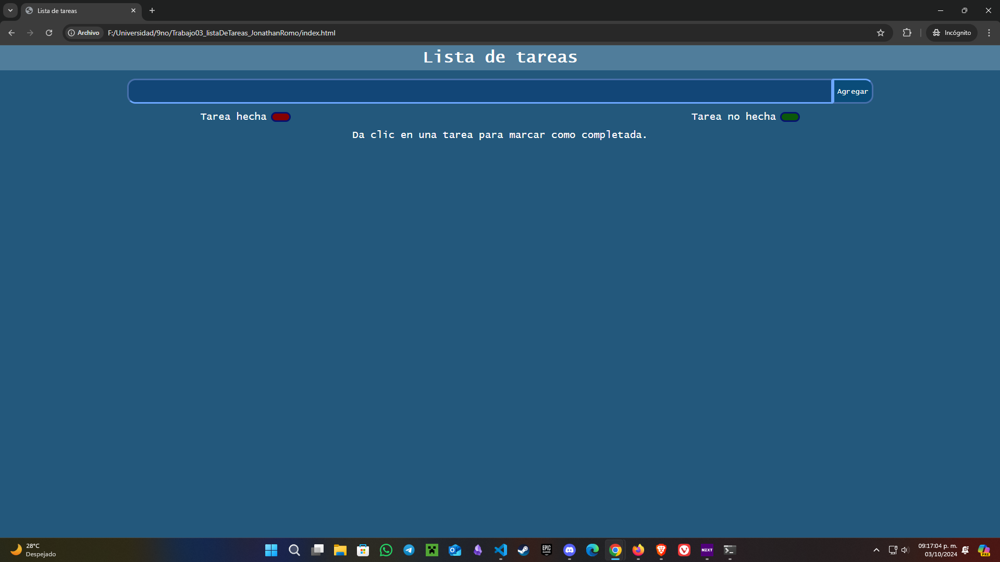
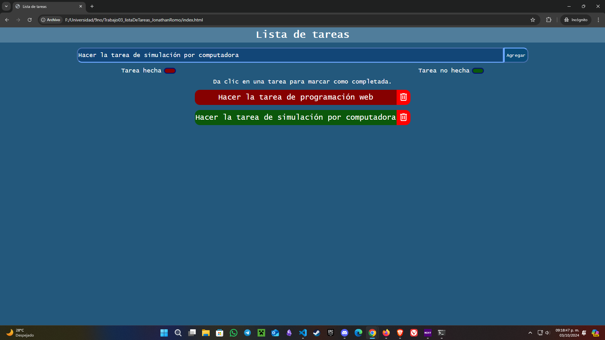
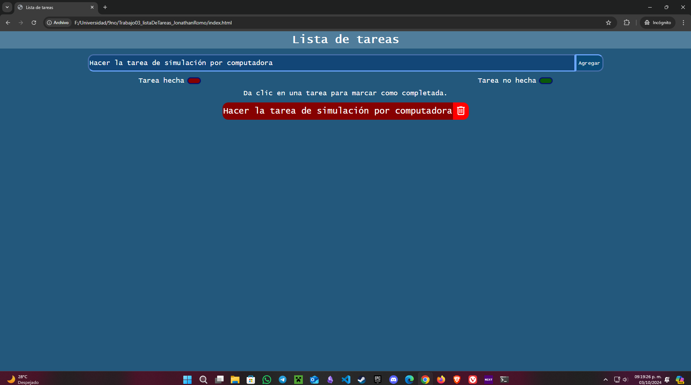

## Trabajo 03: Lista de tareas

Este trabajo fue realizado solamente con html, css y javascript, por lo que para ver la página solo se necesita abrir el html en un navegador web. 
Para agregar una nueva tarea es necesario agregar texto, si no se agrega se mostará una alerta para ingresar texto. Después se dará clic en el botón "Agregar" y se agregará una nueva tarea.
Si se desea marcar como realizada una tarea es necesario hacer clic en la tarea y esta se marcará como completada, y si se desea desmarcar como completada, solamente se necesita hacer clic de nuevo en la tarea.
Si se desea eliminar una tarea, se debe dar clic en el botón con el bote de basura a la derecha de la tarea.

2 tareas agregadas y una marcada como completada

Elimminación de la primer tarea y marcado de la segunda como completada

