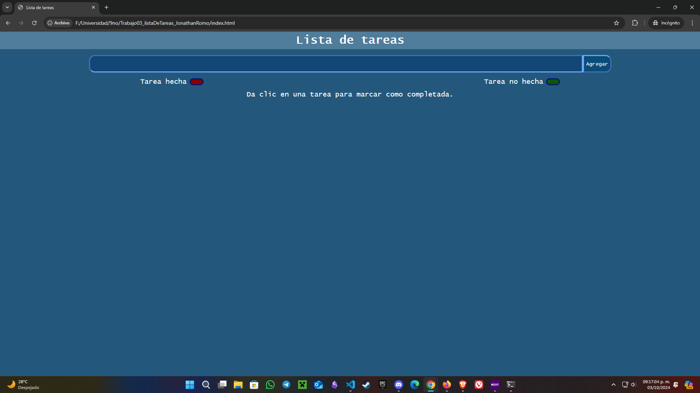
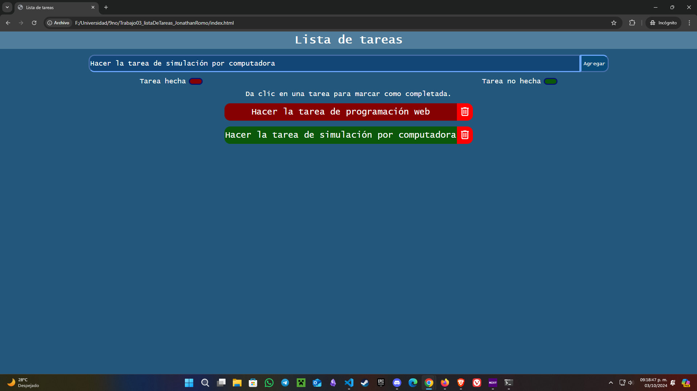
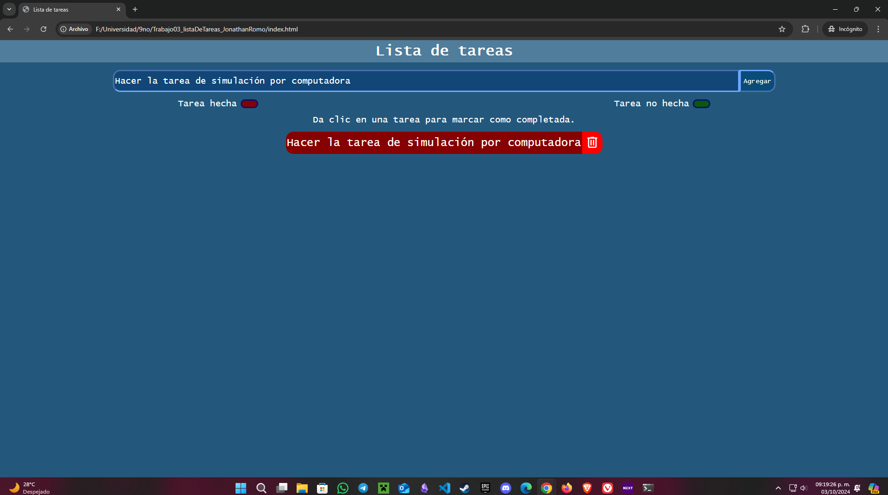

## Trabajo 04: Agregar Almacenamiento en SQLite

Este trabajo no tuvo cambios en el diseño, sino en al funcionalidad, por lo que visiblemente no se notará nada. Sin embargo, al recargar la página se obtendrán las tareas anteriores y sus estados, y se podrán eliminar definitivamente de la base de datos. Para ejecutar la aplicación esta vez es necesario contar con node, y una vez se tenga en la carpeta del proyecto se ejecutará el siguiente comando.

```bash
npm install
```

Después cuando se hayan instalado las dependencias se puede ejecutar el programa con el siguiente comando.

```bash
npm start
```

Ahora solo es necesario abrir el archivo index.html en el navegador.



2 tareas agregadas y una marcada como completada


Elimminación de la primer tarea y marcado de la segunda como completada

